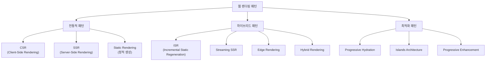
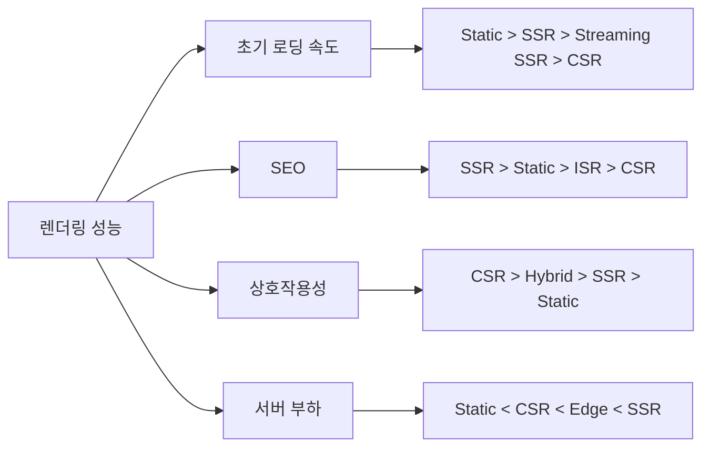
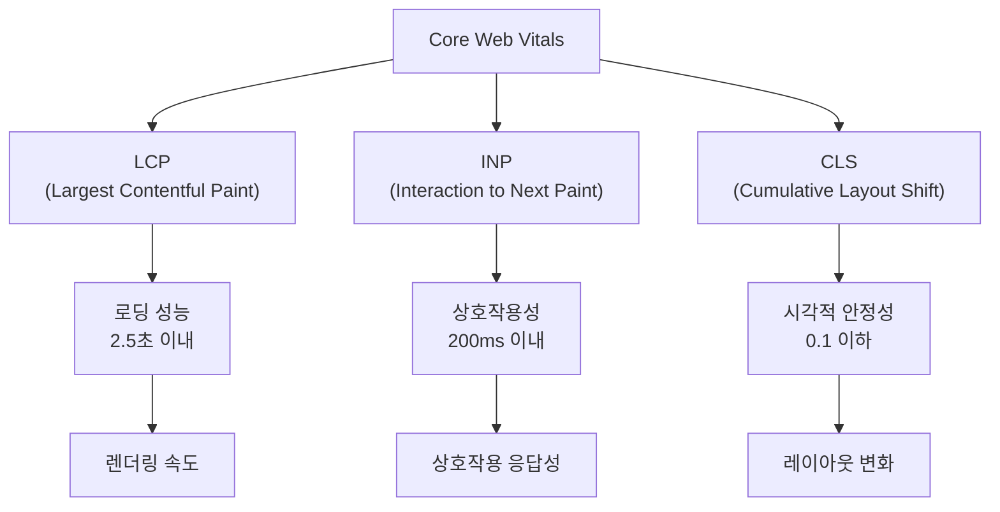

## 렌더링 패턴 분류



## 1. 기본 렌더링 패턴

### CSR (Client-Side Rendering)

#### 기본 개념과 동작 원리
**특징**
- 브라우저에서 JavaScript를 통해 동적으로 컨텐츠 생성
- 초기 HTML은 거의 비어있고, JS가 로드된 후 DOM 조작
- SPA(Single Page Application)에서 주로 사용
- 새로고침 없이 탐색을 지원하는 SPA를 구축할 수 있게 하여 뛰어난 사용자 경험을 제공

#### 최적화 기법

**코드 분할 (Code Splitting) 전략**
```javascript
// Route-based 코드 분할
const LazyHome = React.lazy(() => import('./pages/Home'));
const LazyAbout = React.lazy(() => import('./pages/About'));
const LazyProfile = React.lazy(() => import('./pages/Profile'));

// Component-based 코드 분할
const LazyModal = React.lazy(() => 
  import('./components/Modal').then(module => ({
    default: module.Modal
  }))
);

// Vendor 라이브러리 분할
const splitChunks = {
  chunks: 'all',
  cacheGroups: {
    vendor: {
      test: /[\\/]node_modules[\\/]/,
      name: 'vendors',
      chunks: 'all',
    },
    common: {
      name: 'common',
      minChunks: 2,
      chunks: 'all',
      enforce: true
    }
  }
};
```

**상태 관리 최적화**
```javascript
// 상태 분할과 지연 로딩
const useAsyncState = (asyncFunction, dependencies) => {
  const [state, setState] = useState({ loading: true, data: null, error: null });
  
  useEffect(() => {
    let cancelled = false;
    setState({ loading: true, data: null, error: null });
    
    asyncFunction()
      .then(data => {
        if (!cancelled) {
          setState({ loading: false, data, error: null });
        }
      })
      .catch(error => {
        if (!cancelled) {
          setState({ loading: false, data: null, error });
        }
      });
    
    return () => { cancelled = true; };
  }, dependencies);
  
  return state;
};

// Concurrent Features 활용 (React 18+)
const useDeferredValue = (value) => {
  const [deferredValue, setDeferredValue] = useState(value);
  
  useEffect(() => {
    const timeoutId = setTimeout(() => {
      setDeferredValue(value);
    }, 0);
    
    return () => clearTimeout(timeoutId);
  }, [value]);
  
  return deferredValue;
};
```


**장점**
- **서버 부하 감소**: 렌더링 작업을 클라이언트로 분산
- **페이지 간 빠른 전환**: Virtual DOM과 클라이언트 라우팅
- **풍부한 상호작용**: 즉각적인 UI 반응성
- **오프라인 지원**: Service Worker를 통한 캐싱
- **개발 생산성**: Hot Reloading, 컴포넌트 기반 개발

**단점**
- **초기 로딩 시간**: 번들 크기에 비례하여 증가
- **SEO 한계**: 검색 엔진 크롤러의 JavaScript 실행 의존성
- **JavaScript 의존성**: JS 비활성화 시 완전 비기능
- **메모리 사용량**: 클라이언트 측 상태 관리로 인한 메모리 증가
- **번들 크기 관리**: 복잡도 증가에 따른 지속적 최적화 필요

**예시 프레임워크 및 도구**
- **React**: Vite + React
- **Vue.js**: Vue CLI, Nuxt.js (SPA 모드)
- **Angular**: Angular CLI, Angular Universal (CSR 모드)
- **Svelte**: SvelteKit (SPA 모드)

---

### SSR (Server-Side Rendering)

#### 기본 개념과 동작 원리
**특징**
- 서버에서 HTML을 완전히 생성하여 전송
- 클라이언트는 완성된 HTML을 받아 즉시 렌더링
- 각 요청마다 서버에서 페이지 생성
- 하이드레이션을 통해 클라이언트 사이드에서 UI 컴포넌트의 상태를 재생성

#### 하이드레이션 메커니즘

```javascript
// 서버 사이드 렌더링
import { renderToString } from 'react-dom/server';
import { StaticRouter } from 'react-router-dom/server';

const serverRender = (url, initialData) => {
  // 1. 서버에서 컴포넌트 트리 생성
  const app = (
    <StaticRouter location={url}>
      <DataProvider initialData={initialData}>
        <App />
      </DataProvider>
    </StaticRouter>
  );
  
  // 2. HTML 문자열로 변환
  const html = renderToString(app);
  
  // 3. 초기 상태 직렬화
  const serializedState = JSON.stringify(initialData);
  
  return `
    <!DOCTYPE html>
    <html>
      <head><title>SSR App</title></head>
      <body>
        <div id="root">${html}</div>
        <script>
          window.__INITIAL_STATE__ = ${serializedState};
        </script>
        <script src="/bundle.js"></script>
      </body>
    </html>
  `;
};

// 클라이언트 사이드 하이드레이션
import { hydrateRoot } from 'react-dom/client';

const clientHydrate = () => {
  // 1. 직렬화된 상태 복원
  const initialState = window.__INITIAL_STATE__;
  delete window.__INITIAL_STATE__;
  
  // 2. 하이드레이션 실행
  const root = hydrateRoot(
    document.getElementById('root'),
    <BrowserRouter>
      <DataProvider initialData={initialState}>
        <App />
      </DataProvider>
    </BrowserRouter>
  );
  
  // 3. 하이드레이션 완료 후 정리
  root.onHydrated = () => {
    performance.mark('hydration-complete');
  };
};
```

 
**장점**
- **빠른 초기 페이지 로딩**: 완성된 HTML 즉시 렌더링
- **SEO 친화적**: 검색 엔진 크롤러가 완전한 컨텐츠에 접근
- **저사양 기기 호환성**: 서버에서 무거운 작업 처리
- **보안성**: 민감한 로직을 서버에서 처리
- **네트워크 의존성 감소**: 초기 컨텐츠는 네트워크 상태와 무관

**단점**
- **서버 부하 증가**: 각 요청마다 렌더링 수행
- **TTFB 증가**: 서버 처리 시간만큼 지연
- **하이드레이션 복잡성**: 서버-클라이언트 상태 동기화 필요
- **개발 복잡도**: 서버/클라이언트 환경 차이 고려
- **확장성 제약**: 서버 리소스에 따른 동시 처리 한계

**예시 프레임워크 및 구현**
- **Next.js**: getServerSideProps, App Router
- **Nuxt.js**: asyncData, fetch hooks
- **SvelteKit**: load functions
- **Remix**: loader functions

---

### Static Rendering (정적 생성)

#### 기본 개념과 동작 원리
**특징**
- 빌드 시점에 미리 HTML 파일들 생성
- CDN을 통한 빠른 배포 및 쉽게 캐싱
- 컨텐츠가 변경되지 않는 페이지에 적합
- 런타임 서버 처리 없이 정적 파일 서빙

#### 고급 빌드 최적화 기법

**증분 빌드 시스템**
```javascript
// 변경 감지 및 증분 빌드
const crypto = require('crypto');
const fs = require('fs').promises;

class IncrementalBuilder {
  constructor() {
    this.buildCache = new Map();
    this.fileHashes = new Map();
  }
  
  async calculateFileHash(filePath) {
    const content = await fs.readFile(filePath);
    return crypto.createHash('md5').update(content).digest('hex');
  }
  
  async shouldRebuild(filePath) {
    const currentHash = await this.calculateFileHash(filePath);
    const previousHash = this.fileHashes.get(filePath);
    
    if (currentHash !== previousHash) {
      this.fileHashes.set(filePath, currentHash);
      return true;
    }
    
    return false;
  }
  
  async buildPage(pageData) {
    const cacheKey = this.generateCacheKey(pageData);
    
    if (this.buildCache.has(cacheKey)) {
      console.log(`캐시에서 페이지 재사용: ${pageData.route}`);
      return this.buildCache.get(cacheKey);
    }
    
    const html = await this.renderPage(pageData);
    this.buildCache.set(cacheKey, html);
    
    return html;
  }
  
  generateCacheKey(pageData) {
    const dataString = JSON.stringify(pageData);
    return crypto.createHash('sha256').update(dataString).digest('hex');
  }
}
```

**동적 라우팅 처리**
```javascript
// 동적 라우팅 정적 생성
const generateStaticPaths = async () => {
  // 1. 데이터 소스에서 모든 가능한 경로 수집
  const posts = await fetchAllPosts();
  const categories = await fetchAllCategories();
  const users = await fetchAllUsers();
  
  const paths = [
    // 블로그 포스트 경로
    ...posts.map(post => ({
      params: { slug: post.slug },
      locale: post.locale
    })),
    
    // 카테고리 페이지 경로
    ...categories.map(category => ({
      params: { category: category.slug },
      priority: category.postCount > 10 ? 'high' : 'low'
    })),
    
    // 사용자 프로필 경로
    ...users.map(user => ({
      params: { userId: user.id.toString() },
      revalidate: user.isActive ? 3600 : false // 활성 사용자만 재생성
    }))
  ];
  
  return {
    paths,
    fallback: 'blocking' // 누락된 경로는 런타임에 생성
  };
};
```


**장점**
- **최고의 성능**: CDN에서 즉시 서빙, TTFB < 50ms
- **확장성**: 트래픽 증가에 관계없이 안정적 성능
- **보안성**: 공격 표면 최소화, 서버 취약점 없음
- **비용 효율성**: 서버 리소스 불필요, CDN 비용만 발생
- **안정성**: 서버 장애와 무관한 서비스 가용성

**단점**
- **실시간 업데이트 불가**: 컨텐츠 변경 시 재빌드 필요
- **빌드 시간 증가**: 페이지 수에 비례하여 빌드 시간 증가
- **동적 컨텐츠 제약**: 사용자별 개인화 어려움
- **API 의존성**: 동적 데이터를 위한 별도 API 필요
- **개발 복잡성**: 빌드 파이프라인 관리 복잡

**예시 도구 및 플랫폼**
- **Gatsby**: GraphQL 기반 데이터 레이어
- **Next.js SSG**: getStaticProps/getStaticPaths
- **VuePress**: Vue 기반 정적 사이트
- **Jekyll**: Ruby 기반 정적 생성기
- **Hugo**: Go 기반 초고속 빌드
- **11ty**: JavaScript 기반 정적 생성기

## 2. 하이브리드 패턴

### ISR (Incremental Static Regeneration)
**특징**
- 정적 생성과 서버 렌더링의 결합
- 특정 시간 간격마다 캐시 자동 무효화 및 페이지 재생성 가능
- SWR(Stale-While-Revalidate) 전략을 사용

**SWR 패턴이란?**
SWR(Stale-While-Revalidate)은 원래 **HTTP Cache-Control 헤더의 확장 디렉티브**로 RFC 5861에서 정의된 개념입니다. 

**핵심 동작 원리**
1. **즉시 응답**: 캐시된 데이터를 먼저 반환하여 빠른 응답 제공
2. **백그라운드 업데이트**: 동시에 새로운 데이터를 요청
3. **자동 갱신**: 새 데이터가 도착하면 UI를 업데이트

**장점**
- 정적 생성의 속도 + 동적 컨텐츠 지원
- 캐시 효율성
- 점진적 업데이트 가능

**단점**
- 복잡한 캐시 관리
- 일시적으로 오래된 컨텐츠 표시 가능

**구현 예시:**

**Pages Router 방식**
```javascript
// pages/posts/[slug].js
export default function PostPage({ post }) {
  return <h1>{post.title}</h1>;
}

export async function getStaticPaths() {
  const posts = await fetchPopularPosts();
  const paths = posts.map(post => ({ params: { slug: post.slug } }));

  return {
    paths,
    fallback: 'blocking'
  };
}

export async function getStaticProps({ params }) {
  const post = await fetchPost(params.slug);
  
  return {
    props: { post },
    revalidate: 60 // ISR: 60초마다 재생성
  };
}
```

**App Router 방식**
```typescript
// app/posts/[slug]/page.tsx
export async function generateStaticParams() {
  const posts = await fetchPopularPosts();
  return posts.map(post => ({ slug: post.slug }));
}

async function fetchPost(slug: string) {
  const res = await fetch(`/api/posts/${slug}`, {
    next: { revalidate: 60 } // ISR: 60초마다 재검증
  });
  return res.json();
}

export default async function PostPage({ params }) {
  const post = await fetchPost(params.slug);
  return <h1>{post.title}</h1>;
}
```

### On-demand ISR

#### 기본 개념과 동작 원리
**특징**
- 특정 이벤트 발생 시 수동으로 페이지 재생성 트리거
- 시간 기반이 아닌 이벤트 기반 재생성
- 전역 캐시 무효화로 모든 엣지에서 즉시 업데이트
- Webhook이나 API 호출을 통한 선택적 재생성

#### 일반 ISR vs On-demand ISR 비교

| 구분 | 일반 ISR | On-demand ISR |
|------|----------|---------------|
| **트리거** | 시간 기반 (revalidate) | 이벤트 기반 (API 호출) |
| **재생성 시점** | 사용자 요청 시 시간 확인 | 즉시 재생성 |
| **캐시 범위** | 요청한 엣지 노드만 | 전체 엣지 네트워크 |
| **지연 시간** | 첫 사용자가 stale 컨텐츠 경험 | 모든 사용자가 최신 컨텐츠 |
| **비용** | 정기적 재생성으로 비용 증가 | 필요시에만 재생성 |

#### 사용 사례

**CMS 컨텐츠 업데이트**
```javascript
// CMS Webhook 핸들러
export default async function handler(req, res) {
  // CMS에서 컨텐츠 업데이트 시 호출
  if (req.method === 'POST') {
    const { slug, type } = req.body;
    
    try {
      // 특정 페이지 재생성
      await res.revalidate(`/blog/${slug}`);
      
      // 관련 페이지들도 함께 재생성
      if (type === 'blog') {
        await res.revalidate('/blog'); // 목록 페이지
        await res.revalidate('/'); // 홈페이지
      }
      
      return res.json({ revalidated: true });
    } catch (err) {
      return res.status(500).send('Error revalidating');
    }
  }
}
```

#### 구현 전략

**1. API 엔드포인트 설계**
```javascript
// pages/api/revalidate.js
export default async function handler(req, res) {
  // 보안 검증
  if (req.query.secret !== process.env.REVALIDATE_SECRET) {
    return res.status(401).json({ message: 'Invalid token' });
  }

  try {
    const { paths, tags } = req.body;
    
    // 경로 기반 재생성
    if (paths) {
      await Promise.all(
        paths.map(path => res.revalidate(path))
      );
    }
    
    // 태그 기반 재생성 (Next.js 13+)
    if (tags) {
      await Promise.all(
        tags.map(tag => res.revalidateTag(tag))
      );
    }
    
    return res.json({ 
      revalidated: true, 
      timestamp: new Date().toISOString() 
    });
  } catch (err) {
    return res.status(500).send('Error revalidating');
  }
}
```

**2. 태그 기반 재생성 (Next.js 13+)**
```javascript
// app/blog/[slug]/page.js
import { notFound } from 'next/navigation';

export default async function BlogPost({ params }) {
  const post = await fetch(`/api/posts/${params.slug}`, {
    next: { 
      tags: [`post-${params.slug}`, 'posts'] 
    }
  }).then(res => res.json());

  if (!post) notFound();

  return (
    <article>
      <h1>{post.title}</h1>
      <div>{post.content}</div>
    </article>
  );
}

// 특정 포스트만 재생성
await fetch('/api/revalidate', {
  method: 'POST',
  body: JSON.stringify({ 
    tags: [`post-${postId}`] 
  })
});
```

**장점**
- **즉시 업데이트**: 컨텐츠 변경 시 전체 네트워크에서 즉시 반영
- **비용 효율성**: 필요한 경우에만 재생성하여 서버리스 함수 호출 최소화
- **정확한 제어**: 특정 페이지나 태그만 선택적으로 재생성 가능
- **일관성**: 모든 사용자가 동시에 최신 컨텐츠 경험
- **성능**: 불필요한 재생성 방지로 전체적인 성능 향상

**단점**
- **구현 복잡성**: Webhook 설정 및 에러 처리 필요
- **의존성**: 외부 시스템(CMS, API)과의 연동 필요
- **장애 대응**: 재생성 실패 시 수동 복구 과정 필요
- **보안 고려**: API 엔드포인트 보안 설정 중요
- **모니터링**: 재생성 상태 추적 및 로깅 시스템 필요

### Streaming SSR
**특징**
- 서버에서 HTML을 청크 단위로 스트리밍
- 페이지의 일부부터 점진적으로 렌더링
- React 18의 Suspense와 함께 사용
- 네트워크 정체 현상에 효과적

**장점**
- 빠른 First Contentful Paint
- 점진적 로딩으로 사용자 경험 개선
- 서버 메모리 효율성

**단점**
- 구현 복잡성
- 일부 브라우저 호환성 이슈

**구현 예시:**
```javascript
// React 18 Streaming SSR
function App() {
  return (
    <Suspense fallback={<Loading />}>
      <SlowComponent />
    </Suspense>
  );
}
```

### Edge Rendering
**특징**
- CDN 엣지 서버에서 렌더링 수행
- 사용자와 가까운 위치에서 처리
- Cloudflare Workers, Vercel Edge Functions 등

**장점**
- 지연 시간 최소화
- 글로벌 확장성
- 서버 부하 분산

**단점**
- 제한된 런타임 환경
- 복잡한 로직 구현 어려움

### Hybrid Rendering
**특징**
- 페이지별로 다른 렌더링 전략 적용
- 컨텐츠 특성에 따른 최적화
- 동적 라우팅과 정적 생성 결합

**장점**
- 페이지별 최적화
- 유연한 아키텍처
- 성능과 기능의 균형

**단점**
- 복잡한 구성 관리
- 일관성 유지 어려움

## 3. 최적화 패턴

### Progressive Hydration
**특징**
- 각 노드를 시간에 따라 개별적으로 하이드레이션하여 필요한 최소한의 자바스크립트만 요청하는 방식
- SSR에서 흔히 발생하는 서버에서 렌더링된 DOM트리가 파괴되고 즉시 다시 생성되는 문제를 방지할 수 있음
- 시간이 지남에 따라 점진적으로 hydration
- 우선순위에 따른 단계적 활성화
- 사용자 상호작용에 따른 lazy hydration

**장점**
- 부드러운 사용자 경험
- 리소스 효율적 사용
- 성능 최적화

**단점**
- 구현 복잡성
- 예측하기 어려운 동작

### Islands Architecture
**특징**
- 정적 HTML 페이지에 독립적인 interactive "island" 추가
- 각 컴포넌트가 독립적으로 hydration
- Astro, Fresh 등에서 채택
- 점진적 하이드레이션과의 뚜렷한 차이점은 페이지 하이드레이션 구조가 하향식임
- 아일랜드 아키텍처는 각 컴포넌트가 자체적으로 하이드레이션 스크립트를 갖고 있고 페이지의 다른 스크립트와 독립적으로 비동기 실행됨

**장점**
- 최소한의 JavaScript 사용
- 높은 성능
- 독립적인 컴포넌트 관리

**단점**
- 컴포넌트 간 상태 공유 어려움
- 제한적인 상호작용

**예시 프레임워크:** Astro, Fresh, Qwik

### Progressive Enhancement
**특징**
- 기본 HTML/CSS로 시작하여 점진적으로 기능 추가
- JavaScript 없이도 기본 기능 동작
- 접근성과 호환성 중시

**장점**
- 높은 접근성
- 네트워크 오류에 강함
- 다양한 환경 지원

**단점**
- 개발 복잡성 증가
- 모던 UX 구현 제한

## 성능 비교



## 성능 비교

| 패턴 | 초기 로딩 | SEO | 상호작용 | 서버 부하 | 복잡도 | 적합한 사용 사례 |
|------|-----------|-----|----------|-----------|--------|------------------|
| **CSR** | 느림 | 나쁨 | 우수 | 낮음 | 낮음 | 대시보드, 관리자 패널 |
| **SSR** | 빠름 | 우수 | 보통 | 높음 | 중간 | 뉴스 사이트, 블로그 |
| **Static** | 매우 빠름 | 우수 | 제한적 | 없음 | 낮음 | 문서, 마케팅 페이지 |
| **ISR** | 빠름 | 우수 | 보통 | 중간 | 높음 | 전자상거래, CMS |
| **Streaming SSR** | 빠름 | 우수 | 우수 | 중간 | 높음 | 복잡한 웹 앱 |
| **Edge Rendering** | 매우 빠름 | 우수 | 보통 | 분산 | 높음 | 글로벌 서비스 |
| **Islands** | 빠름 | 우수 | 선택적 | 낮음 | 중간 | 컨텐츠 중심 사이트 |

## 렌더링 패턴 선택 가이드

### 1. 프로젝트 특성에 따른 선택

**정적 컨텐츠 위주 (블로그, 문서 사이트)**
- Static Rendering
- Islands Architecture
- Progressive Enhancement

**동적 컨텐츠 + SEO 중요 (뉴스, 전자상거래)**
- SSR
- ISR
- Hybrid Rendering

**복잡한 상호작용 (대시보드, 앱)**
- CSR
- Partial Hydration
- Progressive Hydration

**글로벌 서비스 (CDN 활용)**
- Edge Rendering
- Static + Edge Functions

### 2. 성능 요구사항별 선택

**초기 로딩 속도 우선**
- Static Rendering
- Edge Rendering
- Streaming SSR

**SEO 최적화 우선**
- SSR
- Static Rendering
- ISR

**상호작용성 우선**
- CSR
- Hybrid Rendering
- Islands Architecture (선택적)

### 3. 개발 복잡도별 선택

**낮은 복잡도**
- Static Rendering
- CSR
- Progressive Enhancement

**중간 복잡도**
- SSR
- Islands Architecture

**높은 복잡도**
- ISR
- Streaming SSR
- Edge Rendering
- Partial/Progressive Hydration

## 주요 프레임워크별 지원 패턴

### Next.js
- SSR, Static, ISR, Streaming SSR, Edge Rendering, Hybrid

### Nuxt.js
- SSR, Static, ISR, Hybrid, Edge Rendering

### Astro
- Static, Islands Architecture, Partial Hydration

### SvelteKit
- SSR, Static, CSR, Hybrid

### Remix
- SSR, Edge Rendering, Progressive Enhancement

### Qwik
- Islands Architecture, Progressive Hydration, Streaming SSR


## 결론

각 렌더링 패턴은 고유한 장단점이 있으며, 프로젝트의 요구사항에 따라 적절한 선택이 필요합니다. 
현대적인 접근법은 단일 패턴보다는 여러 패턴을 조합한 하이브리드 방식을 선호하는 추세입니다.

**핵심 선택 기준**
- 사용자 경험 (UX) 목표
- SEO 요구사항
- 서버 리소스 제약
- 개발팀 역량
- 유지보수 복잡도

## Core Web Vitals와 렌더링 패턴

### Core Web Vitals 개요

Google이 정의한 웹 사이트의 사용자 경험을 측정하는 핵심 지표들로, SEO 순위에도 직접적인 영향을 미칩니다.



#### 1. LCP (Largest Contentful Paint)
**정의**: 뷰포트 내에서 가장 큰 컨텐츠 요소가 렌더링되는 시점

**좋은 점수**: 2.5초 이내
**개선 필요**: 2.5초 ~ 4초
**나쁜 점수**: 4초 초과

#### 2. INP (Interaction to Next Paint)
**정의**: 사용자 상호작용부터 다음 프레임이 그려지기까지의 시간 ([2024년 3월부터 FID를 대체했음](https://web.dev/blog/inp-cwv-launch?hl=ko#resources_to_optimize_inp))

- **FID와의 차이점**: FID는 첫 상호작용만 측정했지만, INP는 페이지 전체에서 가장 느린 상호작용까지 포함하여 입력부터 화면 반영까지의 전체 시간을 측정해 사용자 경험을 더 정확하게 평가

**좋은 점수**: 200ms 이내
**개선 필요**: 200ms ~ 500ms
**나쁜 점수**: 500ms 초과

#### 3. CLS (Cumulative Layout Shift)
**정의**: 페이지 로딩 과정에서 예상치 못한 레이아웃 이동의 누적 점수

**좋은 점수**: 0.1 이하
**개선 필요**: 0.1 ~ 0.25
**나쁜 점수**: 0.25 초과

### 기타 중요한 Web Vitals

#### 4. FCP (First Contentful Paint)
**정의**: 첫 번째 텍스트나 이미지가 렌더링되는 시점

**좋은 점수**: 1.8초 이내
**개선 필요**: 1.8초 ~ 3초
**나쁜 점수**: 3초 초과

#### 5. TTFB (Time to First Byte)
**정의**: 브라우저가 서버로부터 첫 번째 바이트를 받는 시간

**좋은 점수**: 800ms 이내
**개선 필요**: 800ms ~ 1.8초
**나쁜 점수**: 1.8초 초과

#### 6. TBT (Total Blocking Time)
**정의**: FCP와 TTI 사이에 메인 스레드가 차단된 총 시간

**좋은 점수**: 200ms 이내
**개선 필요**: 200ms ~ 600ms
**나쁜 점수**: 600ms 초과

#### 7. SI (Speed Index)
**정의**: 페이지 컨텐츠가 시각적으로 표시되는 속도

**좋은 점수**: 3.4초 이내
**개선 필요**: 3.4초 ~ 5.8초
**나쁜 점수**: 5.8초 초과

#### 8. FID (First Input Delay) - 참고용
**정의**: 사용자가 페이지와 처음 상호작용할 때부터 브라우저가 응답하기까지의 시간 (INP로 대체됨)

**좋은 점수**: 100ms 이내
**개선 필요**: 100ms ~ 300ms
**나쁜 점수**: 300ms 초과

## 각 렌더링 패턴과 Web Vitals 성능 비교 매트릭스

아래 표는 GPT에게 "각 렌더링 패턴의 Web Vitals 성능을 비교하여 표로 정리해달라"고 요청하여 작성한 내용입니다.
가볍게 참고만 해주세용!

기준이 되는 각 지표는 Google Web.dev의 Web Vitals 공식 기준을 참고했습니다.

| 렌더링 패턴 | LCP | INP | CLS | FCP | TTFB | TBT | SI | 종합 점수 |
|-------------|-----|-----|-----|-----|------|-----|----|-----------| 
| **CSR** | ⚠️ 보통<br/>(3-6초) | ⚠️ 보통<br/>(200-400ms) | ✅ 좋음<br/>(0.05-0.1) | ⚠️ 보통<br/>(2-4초) | ✅ 좋음<br/>(200-600ms) | ❌ 나쁨<br/>(600ms+) | ⚠️ 보통<br/>(4-7초) | ⚠️ 보통 |
| **SSR** | ✅ 좋음<br/>(1.5-2.5초) | ⚠️ 주의<br/>(150-300ms) | ⚠️ 주의<br/>(0.1-0.2) | ✅ 좋음<br/>(1-2초) | ⚠️ 보통<br/>(800ms-1.5초) | ⚠️ 보통<br/>(200-500ms) | ✅ 좋음<br/>(2-4초) | ✅ 좋음 |
| **Static** | ✅ 우수<br/>(0.8-1.5초) | ✅ 우수<br/>(50-150ms) | ✅ 우수<br/>(0.01-0.05) | ✅ 우수<br/>(0.5-1.5초) | ✅ 우수<br/>(100-400ms) | ✅ 좋음<br/>(100-300ms) | ✅ 우수<br/>(1-3초) | ✅ 우수 |
| **Streaming SSR** | ✅ 좋음<br/>(1.2-2.0초) | ✅ 좋음<br/>(100-200ms) | ⚠️ 주의<br/>(0.1-0.15) | ✅ 우수<br/>(0.8-1.5초) | ⚠️ 보통<br/>(600ms-1.2초) | ✅ 좋음<br/>(150-400ms) | ✅ 좋음<br/>(2-4초) | ✅ 좋음 |
| **Islands** | ✅ 우수<br/>(0.9-1.6초) | ✅ 우수<br/>(30-120ms) | ✅ 좋음<br/>(0.03-0.08) | ✅ 우수<br/>(0.6-1.3초) | ✅ 좋음<br/>(300-700ms) | ✅ 우수<br/>(50-200ms) | ✅ 우수<br/>(1.5-3.5초) | ✅ 우수 |
| **Edge** | ✅ 우수<br/>(0.8-1.8초) | ✅ 좋음<br/>(80-180ms) | ✅ 좋음<br/>(0.05-0.1) | ✅ 우수<br/>(0.5-1.2초) | ✅ 우수<br/>(50-300ms) | ✅ 좋음<br/>(100-350ms) | ✅ 우수<br/>(1-3초) | ✅ 우수 |

**공식 지표 구간 참고 자료**
  - [Web Vitals](https://web.dev/vitals/)
  - [Largest Contentful Paint (LCP)](https://web.dev/lcp/)
  - [Interaction to Next Paint (INP)](https://web.dev/inp/)
  - [Cumulative Layout Shift (CLS)](https://web.dev/cls/)
  - [First Contentful Paint (FCP)](https://web.dev/fcp/)
  - [Time to First Byte (TTFB)](https://web.dev/ttfb/)
  - [Total Blocking Time (TBT)](https://web.dev/tbt/)
  - [Speed Index (SI)](https://web.dev/speed-index/)
  - [First Input Delay (FID)](https://web.dev/fid/) - 참고용

**참고 자료**
- [Rendering on the Web](https://web.dev/rendering-on-the-web/) - Google Web.dev